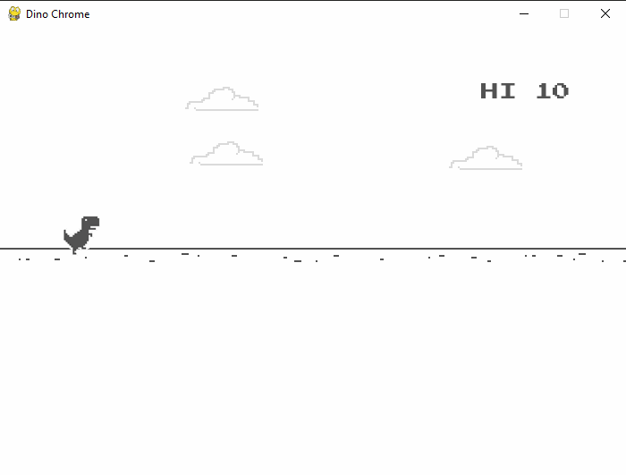

# Dino from Google Chrome using Pygame (simplified version)

This project was developed by [Python 3.9.0](https://www.python.org/downloads/).

## Dependencies
* [Python 3.9.0](https://www.python.org/downloads/)
* [Pygame 2.0.0](https://www.python.org/downloads/)

To start the program, run the command:

    python main.py
